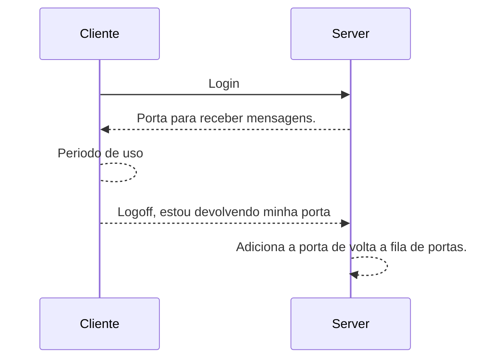

# Computação Distribuída - Trabalho 1

Sistema de mensagem estilo e-mail e mensagem direta entre clientes.

# Como usar
Instale ZMQ caso não tenha instalado

    pip install zmq

Abra um terminal e inicie um processo para o servidor

    python3 socket_server.py
Abra pelo menos dois outros terminais e inicie processos de cliente

    python3 socket_client.py

Siga as intruções fornecidas dentro do programa.

# Conexão com servidor

Resumo cliente-servidor com relação a alocação de sockets

# E-Mail Publisher-Subscriber
O usuário pode deve fornecer os tópicos que tem interesse no momento de login ou durante operação. Clientes podem mandar e-mails para outros usuários através do servidor com comando @(tópico). É possível mandar mensagem única para apenas um usuário utilizando seu username como tópico.


## Conexão para mensagem direta
O padrão Push-Pull é utilizado para evitar a necessidade do envio de sinais de ACK como seria necessário no REQ-REP. X conecta seu socket PUSH no socket PULL de Y e vice-versa

```mermaid
sequenceDiagram

Cliente X ->> Server: {X} {Y} {Porta X}
Server-->>Cliente Y: {Y} pedido_conversa {X} {Porta X}
Note right of Cliente Y: Assumindo que Y aceitou a conexão
Cliente Y -->> Cliente Y: Aceita e conecta ao Porta X
Cliente Y-->> Cliente X: {Porta Y}
Cliente X --> Cliente Y: Troca de mensagens até alguém sair da conversa


